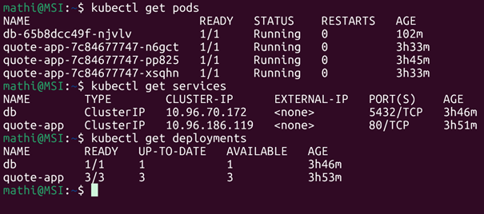
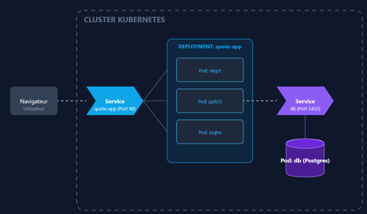
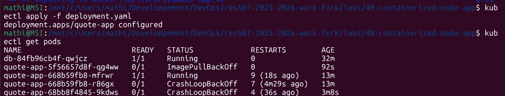
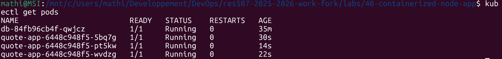

# Notes d'Architecture - Lab 85

## 1. Map the current architecture

**Where does isolation happen?**
L'isolation principale se fait au niveau du Pod. Chaque Pod possède sa propre pile réseau et son système de fichiers, ce qui le sépare des autres Pods du même nœud.

**What restarts automatically?**
Le Kubelet surveille les conteneurs et redémarre automatiquement un conteneur s'il crash. Au niveau supérieur, le Deployment s'assure que le nombre de répliques (3 pour quote-app) est toujours maintenu, il recrée un Pod si celui-ci disparaît. 

**What does Kubernetes not manage?**
De base, les fichiers ne sont pas persistants sauf si on ajoute un volume. Aussi, Kubernetes ne gère pas s’il y a une erreur dans le code, cela lancera une app buggée en boucle.

---

## 2. Compare containers and virtual machines

**Create a comparison table with at least five differences.**

| Caractéristique | Conteneurs | Machines Virtuelles |
| :--- | :--- | :--- |
| **Partage du Kernel** | Partagent le noyau de l'OS hôte | Chaque VM possède son propre noyau |
| **Temps de démarrage** | Quelques secondes | Quelques minutes |
| **Poids & Ressources** | Très légers et faible overhead | Très lourds et overhead élevé (Hypervisor + OS) |
| **Isolation / Sécurité** | Isolation au niveau processus | Isolation matérielle |
| **Complexité Opé.** | Nécessite un orchestrateur (ex : kubernetes) | Snapshot, Backup image |
| **Portabilité** | Indépendant de l’infrastructure | Dépendante de l'hyperviseur et de l'architecture |

**When would you prefer a VM over a container?**
On préfère une VM pour séparer des services afin qu'ils aient chacun un noyau et ne se ralentissent pas entre eux en cas de bug. C'est aussi utile pour faire tourner une application Windows sur un serveur Linux, utiliser une version précise du kernel non disponible sur l'hôte, ou pour isoler deux clients différents sur un même serveur physique.

**When would you combine both?**
On combine les deux pour conserver la rapidité des conteneurs et l'isolation de la VM. Cela permet de déplacer une VM avec tous ses conteneurs d'un serveur physique à un autre sans coupure de service, ou de donner des ressources fixes (CPU/RAM) à une équipe via une VM tout en les laissant gérer leurs Pods à l'intérieur.

---

## 3. Introduce horizontal scaling

**What changes when you scale?**
Meilleure disponibilité, l'application devient résiliente car si un Pod tombe parmi les 3 répliques, les deux autres continuent de répondre. Le Service `quote-app` envoie les requêtes aux 3 Pods à tour de rôle, évitant la surcharge d'un seul Pod. Par contre, on utilise 3 fois plus de de ressources, et 3 processus différents ouvrent des connexions vers PostgreSQL en même temps.

**What does not change?**
L'IP et le nom du Service (`quote-app`) restent identiques. L'image Docker utilisée est la même. Les pods lisent et écrivent dans la même base de données et partagent le même état via le Service `db`. Enfin, chaque quote-app à son propre espace isolé, le Pod 1 ne peut pas accéder à la mémoire du Pod 2.

---

## 4. Simulate failure

**Who recreated the pod? Why?**
C'est le ReplicaSet défini dans le fichier `deployment.yaml` qui a recréé le Pod. Il le fait pour maintenir l'état désiré 3 replicas. Dès qu'il voit que le compte tombe à 2, il demande au cluster d'en démarrer un nouveau.

**What would happen if the node itself failed?**
Kubernetes détecterait que le Node est down. Il ordonnerait alors la recréation des Pods perdus sur un autre Node disponible dans le cluster.

---

## 5. Introduce resource limits

**What are requests vs limits? Why are they important in multi-tenant systems?**
* **Requests** (ex: CPU 100m, Memory 128Mi) : C'est le minimum alloué au conteneur.
* **Limits** (ex: CPU 250m, Memory 256Mi) : C'est le maximum que le conteneur ne peut pas dépasser.
  
Elles sont implémentées dans les déploiements pour garantir que dans un système multi-locataires, une seule application ne puisse pas consommer toutes les ressources du nœud et faire crasher les autres services.

---

## 6. Add readiness and liveness probes

**What is the difference between readiness and liveness? Why does this matter in production?**

La Readiness vérifie si l'application est prête à recevoir du trafic et n'envoie pas de requètes tant qu'elle ne l'est pas. Tandis que la Liveness vérifie si elle est toujours saine si elle ne l'est pas, le Kubelet redémarre le conteneur.
En production cela permet de garantir des mises à jour sans interruption et d'automatiser l'auto-réparation des bugs.

---

## 7. Connect Kubernetes to virtualization

**What runs underneath your k3s cluster? Is Kubernetes replacing virtualization?**
Sous le cluster k3s, on trouve généralement un système d'exploitation Linux (ici Ubuntu). Kubernetes ne remplace pas la virtualisation. La virtualisation simule du matériel, tandis que Kubernetes orchestre des applications.

**In a cloud provider, what actually hosts your nodes? Explain how this stack might look in:**
* **A cloud data center :** Le fournisseur fait tourner les nœuds sur des VM. Il gère la couche matérielle (serveur physique -> hyperviseur -> VM), laissant la main sur l'orchestration des conteneurs au-dessus.
* **An embedded automotive system :** Kubernetes tourne directement sur un Linux temps réel installé sur le matériel embarqué, sans couche de virtualisation.
* **A financial institution :** La sécurité impose souvent un modèle hybride : des serveurs physiques privés font tourner des VM isolées pour garantir un cloisonnement strict entre les applications financières sensibles orchestrées par Kubernetes.

---

## 8. Design a production architecture

**What would run in Kubernetes?**
Le cluster accueille la couche applicative et les services éphémères. Cela inclut les micro-services, les serveurs d'API, les frontends, ainsi que les outils d'ingestion de logs et de monitoring. Kubernetes gère les déploiements sans interruption.

**What would run in VMs?**
Les bases de données restent sur des machines virtuelles dédiées, hors du cluster. Même si Kubernetes peut gérer le stockage il est intéressant de laisser la base de données sur une VM pour de meilleurs performances.

**What would run outside the cluster?**
Le Load Balancer, les Docker Registry, le serveur de CI/CD et les systèmes de stockage de sauvegarde. Ils restent indépendants du cluster en cas de problème majeur.

---

## 9. Required break and analysis (Controlled failure)

**Evidence of at least one controlled failure and analysis :**
* **Action :** Panne simulée via l'arrêt forcé d'un Pod `quote-app`.
* **Résultat :** Grâce à la configuration des 3 répliques, l'application est restée disponible. Le Kubelet a détecté le crash, et le ReplicaSet a demandé au cluster de démarrer un nouveau Pod pour maintenir l'état à 3.

---

## 10. Required extension: secret-based configuration

**Why is this better than plain-text configuration?**
L'utilisation de Secrets permet d’enlever les informations sensibles du code source et des fichiers de déploiement. Cela évite que des mots de passe ou des identifiants de base de données n'apparaissent en clair dans l'historique Git.

**Is a Secret encrypted by default? Where?**
Non, par défaut, un Secret Kubernetes n'est pas chiffré, il est simplement encodé en base64. Ils sont stockés dans la base de données du cluster.

---

## 13. Observe rollout progress

**What changed in the cluster during the rollout?**
Kubernetes a créé un nouveau ReplicaSet pour la version v2. On a pu observer la création progressive de nouveaux Pods v2 pendant que les anciens Pods v1 étaient terminés un par un.

**What stayed the same?**
Le nom du Deployment, le Service (quote-app) et son adresse IP ClusterIP sont restés identiques. Les utilisateurs n'ont pas eu besoin de changer d'adresse pour accéder à la nouvelle version.

**How did Kubernetes decide when to create and delete Pods?**
Il utilise les sondes de Readiness. Kubernetes attend qu'un nouveau Pod v2 soit marqué comme "Ready" avant de supprimer un ancien Pod v1. Cela garantit qu'il y a toujours des Pods disponibles pour répondre aux requêtes.

---

## 14. Require one broken rollout

**What failed first?**
La phase de récupération de l'image a échoué car le tag v3 spécifié n'existait pas.

**Which signal showed you the failure fastest?**
Le statut ErrImagePull puis ImagePullBackOff affiché par la commande kubectl get pods a été le signal le plus rapide.

**What would you check next if this happened in production?**
Je lancerais un kubectl describe pod pour lire les événements et confirmer si l'erreur est liée au nom de l'image, au tag, ou à un problème de droits d'accès.

---

## 15. Rollback safely

**What did rollback change?**
Le rollback a forcé le Deployment à revenir à la révision précédente du ReplicaSet (v2), il a restauré les Pods fonctionnels avec la bonne image.

**What did rollback not change?**
Le rollback n'a pas modifié l'adresse IP du Service, le nom du Deployment, ni les ressources persistantes comme la base de données ou le PVC.

---

## 16.1 Option A

**What does maxSurge do?**
Cette option définit le nombre maximum de Pods pouvant être créés au-delà du nombre de répliques souhaité pendant une mise à jour. Par exemple "maxSurge: 1" permet d'avoir 4 Pods temporairement si on en veut 3.

**What does maxUnavailable do?**
Cela définit le nombre maximum de Pods pouvant être indisponibles pendant le processus de mise à jour.

**Why might you choose 0 for maxUnavailable?**
Je choisirais 0 pour garantir que la capacité de l'application ne diminue jamais pendant le déploiement. Kubernetes créera alors un nouveau Pod avant d'en supprimer un ancien pour maintenir une haute disponibilité sous forte charge.

