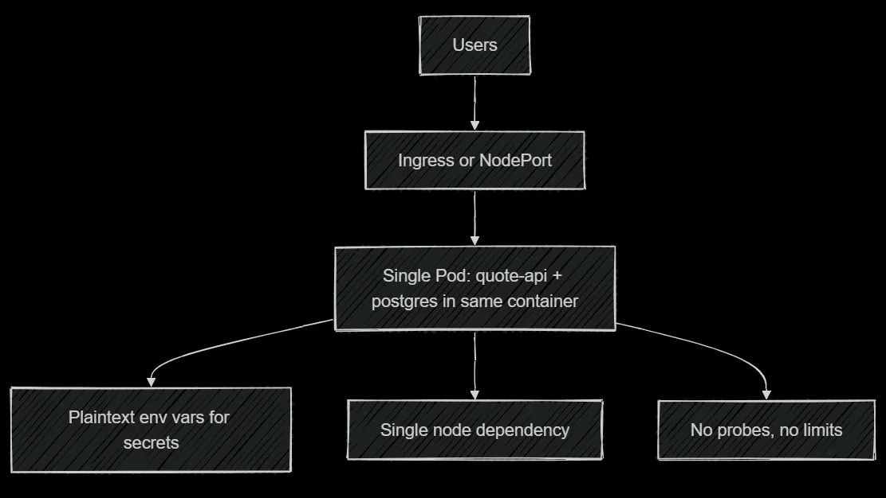
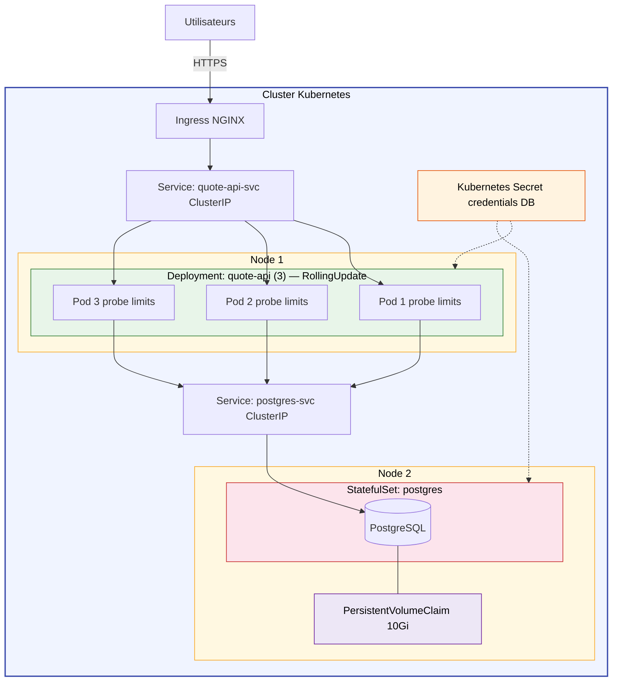

# Architecture Finale — Quote API

---

## Diagramme de l'architecture actuelle (système défaillant)



## Problèmes du système actuel

## 2. Identify the architectural problems
### 2.1 Un seul conteneur pour la BDD et l'API
**What is the problem ?**
PostgreSQL tourne à l'intérieur du même conteneur que le Quote API. 

**Why does it matter ?**
 À chaque redémarrage du pod le processus PostgreSQL est également tué. Si il n'y a pas de volume persistant de données le contenu de la BDD est écrasé et donc perdu.

**What failure or operational risk could it cause ?**
Redémarer l'application détruit les données. De plus, on ne peut pas augmenter le nombre de répliques de l'API si on veut scale sans augmenter le nombre de BDD ce qui est inutile.

### 2.2 Pas de Readiness et liveness
**Quel est le problème ?**
Kubernetes n'a aucun moyen de savoir si l'application est saine ou prête à recevoir du trafic.

**Pourquoi est-ce important ?**
 Kubernetes peut envoyer du trafic à des pods qui ne sont pas encore réellements prêts.

**Quel risque opérationnel cela représente-t-il ?**
On peut faire planter le pod en lui envoyant du traffic alors qu'il n'est pas prêt et il restera bloqué.

### 2.3 Les secrets sont stockés en clair
**Quel est le problème ?**
Les secrets sont définis en texte clair dans les variables d'environnement.

**Pourquoi est-ce important ?**
Si on commit le fichier des variables d'environnement sur le git n'importe qui peut avoir accès à la base de données.

**Quel risque opérationnel cela représente-t-il ?**
N'importe qui peut corrompre nos données. Quoique, si on se réfère au problème numéro 1 au moins les données de la BDD sont effacées à chaque fois :)

### 2.4. Pas de limite de ressources
**Quel est le problème ?**
Le pod n'a pas de requests et limits définies pour le CPU et la mémoire.

**Pourquoi est-ce important ?**
Sans limites, un pod peut consommer toutes les ressources du node.

**Quel risque opérationnel cela représente-t-il ?**
Il va faire ralentir l'ensemble des autres services si il consomme toutes les ressources de l'ordinateur.

### 2.5 Le déployement remplace les pods immédiatement

**Quel est le problème ?**
On supprime l'ancien pod avant d'en créer un nouveau.

**Pourquoi est-ce important ?**
Pendant l'intervalle entre la suppression et le redémarrage l'application est indisponible et donc il y'a une coupure du service coté utilisateur.

**Quel risque opérationnel cela représente-t-il ?**
Chaque mise à jour applicative provoque une coupure du service pour les utilisateurs.

---

## 3. Design an improved architecture


Les utilisateurs envoient leurs requêtes HTTPS à l'Ingress NGINX.L'Ingress transmet le trafic au Service quote-api-svc, qui répartit la charge entre les 3 pods de l'application tournant sur le Node 1.

Les pods passent par le Service postgres-svc pour atteindre la base de données PostgreSQL, qui tourne dans un StatefulSet sur le Node 2. PostgreSQL est attaché à un PersistentVolumeClaim de 10Gi.

Enfin, le Secret Kubernetes est injecté dans le Deployment et le StatefulSet.

---

| Composant | Type Kubernetes
|---|---|
| quote-api | Deployment (3 replicas) |
| Service API | ClusterIP + Ingress |
| postgres | StatefulSet (1 replica) |
| Service DB | ClusterIP |
| Stockage | PersistentVolumeClaim |
| Secrets | Secret Kubernetes |

### Rolout Stratégie 

Pour le RollingUpdate on met maxUnavailable: 0 et maxSurge: 1. A chaque déploiement Kubernetes crée un nouveau pod avant d'en supprimer un ancien. Il attend que la readiness probe du nouveau pod soit ok avant de retirer l'ancien du pool de trafic. Ce cycle se pour chaque replica, garantissant qu'il y a toujours 3 pods disponibles. Si on a un problème, kubectl rollout undo permet de revenir à la version précédente.

Configuration utilisée :
```yaml
strategy:
  type: RollingUpdate
  rollingUpdate:
    maxUnavailable: 0
    maxSurge: 1
```

---

## Operational strategy 

### How does the system scale ?

Le Deployment du Quote API tourne avec 3 replicas répartis sur plusieurs nœuds. En cas de montée en charge, les replicas peuvent être augmentés manuellement ou automatiquement via un HorizontalPodAutoscaler basé sur l'utilisation CPU.

La base de données PostgreSQL reste sur un seul pod elle ne scale pas  dans cette architecture, mais on peut augmenter la taille du volume persistant.

### How are updates deployed safely ?

**RollingUpdate** avec `maxUnavailable: 0` garantit qu'il y a toujours au moins 3 pods disponibles.

 Kubernetes démarre un nouveau pod, attend que sa readiness probe soit verte, puis delete un ancien pod. 
 
 En cas de problème, `kubectl rollout undo` permet de revenir à la version précédente.

### How are failures detected ?

- La **liveness probe** détecte les pods bloqués ou en état d'erreur et les redémare.
  
- La **readiness probe** retire un pod du pool de trafic s'il ne répond plus correctement, sans le tuer tout de suite.

### Which Kubernetes controllers handle recovery ?

| Contrôleur | Rôle dans la récupération |
|---|---|
| **ReplicaSet Controller** | Recrée les pods API si le nombre de replicas tombe en dessous de 3 |
| **StatefulSet Controller** | Recrée le pod PostgreSQL tout en réattachant le même PersistentVolume |
| **Endpoint Controller** | Met à jour la liste des pods sains derrière le Service en temps réel |

---

## Point le plus faible

**La base de données PostgreSQL**
PostgreSQL tourne toujours sur **un seul pod**. Pendant le temps de redémarrage du pod, toutes les requêtes qui nécessitent la base de données échoueront.

De plus, les données sur le persistant volume peuvent etre compliquer à récupérer si le node tombe.

- Une réplication PostgreSQL
- Des dump automatiques

